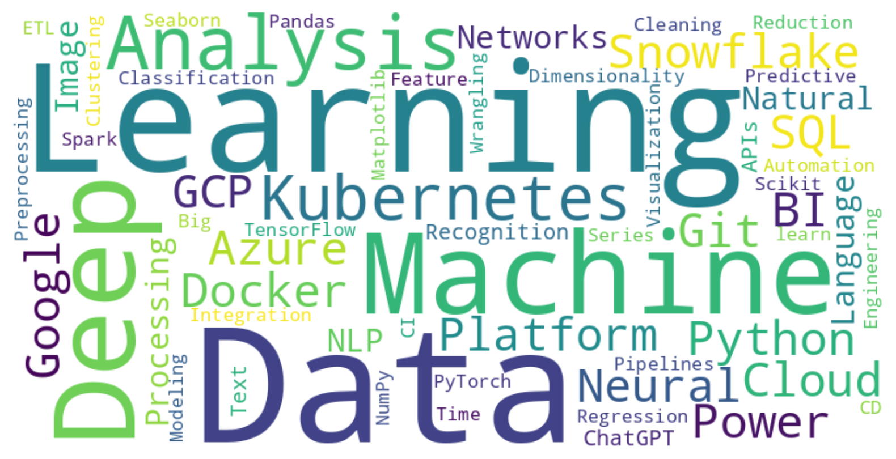

## Hi there, I'm Abby 👋

A <b>Senior Data Analyst & AI Engineer</b> with 7+ years of experience building scalable data pipelines, BI systems, and AI-powered analytics solutions 📊. I specialize in DBT, SQL, Power BI, and cloud-native architectures on Azure — turning complex data into reliable, actionable insights.

Passionate about 🧠 LLM/AI integration, 🔧 data engineering best practices, 📊 business intelligence, and 🚀 empowering teams with data-driven decisions.

#### Portfolio: <a href="troopl.com/abbywang" target="_blank">troopl.com/abbywang</a>

  <h2>About Me</h2>
  

    
    
<b>ENTJ-A:</b> Set up a goal, make a plan, and get it done

  

  

    
    
 <b>Life-long learner:</b> always growing, always curious

  

  

    
    
<b>Sports lover: </b>tennis, pilates, hiking, climbing, running

  

  

    ✈️
    
<b>Travel enthusiast:</b> love connecting with people and cultures

  
  

 

  
 <!-- Horizontal Line -->
  

    <i>成功不必在我 而功力必不唐捐</i> 
    <strong><i>Success does not have to come from me, but every effort will surely yield its value.</i></strong>
  

  
  
  

