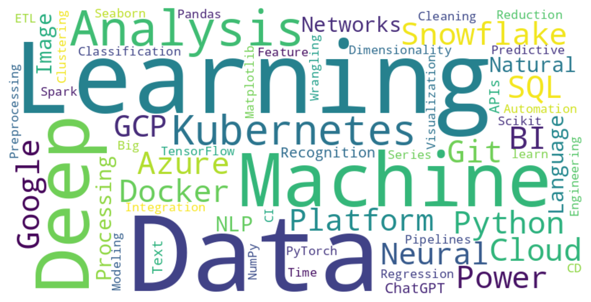

## Hi there, I'm Abby 👋
A <b>Data Scientist</b> passionate about uncovering insights and creating impact through data 📊. I specialize in data cleaning, data collection, and building machine learning models.
Love solving complex problems (predictive modeling, factor analysis, and automation); Enjoy collaborating on exciting projects (image recognition, text analysis, and AI applications) with talented teams. 

I’m a strong advocate for 🧠 AI innovation, 📜 open source collaboration, 🔠data-driven decision-making, and 🚀 pushing boundaries with technology.

### About me
- ENTJ-A: Set up a goal, make a plan, and achieve it
- life-long learner 
- Love connection with people - Travel enthusiast
- As easygoing and curious about the world as a kitten
- Sports lover: tennis, pilates, hiking, climbing, running
- 3 words describe: organized, ambitious, positive

